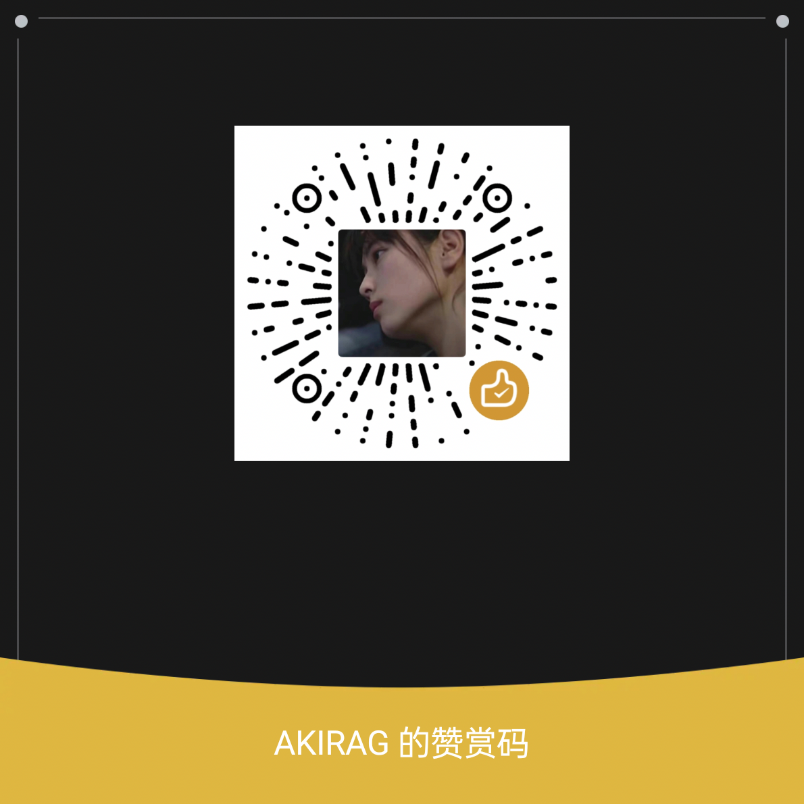

# XHS SaveFix · 小红书解除「作者关闭保存」+ 去水印

一个极简 LSPosed 模块：解除小红书（`com.xingin.xhs`）笔记图片的「作者已关闭下载/保存」限制，并让保存到相册的图片**不带水印**（作者水印 + 「AI生成」标签都不叠）。

> 仅供个人学习与逆向研究使用。请尊重原作者版权与平台规则，勿用于侵权或商业用途。

## 原理（一段话）

保存被拦有**两条门**，模块都拆：

1. **旧门**：笔记数据里 `MediaSaveConfig` 的 JSON 字段 **`disable_save: true`** 表示作者关闭了保存。客户端在下载路径（`DownloadController.onDownloadClick`）里检查 getter `b()`，为 `true` 就弹 toast 并 `return`。模块把 `b()` 强制返回 `false`。
2. **新门**（v9.33.x 服务端灰度，[issue #2](../../issues/2)）：笔记详情改为下发权限数组 `[{"reason":"作者已关闭下载权限，无法保存","type":"image_download","enable":false},...]`，模型 `com.xingin.entities.notedetail.FunctionSwitch`（getter `a()`=enable、`c()`=type）。长按面板和分享面板的「保存图片」按 `enable=false` 置灰。模块对 `image_download`/`video_download` 类型把 `a()` 强制返回 `true`（`ShareInfoDetail$Operate` 的 `disable` 同理）。

**去水印**：保存时的水印是客户端 `jm7.j.a()` 合成的，受两个服务端字段控制——作者水印看 `MediaSaveConfig.c()`（`disable_watermark`，**true 才是不画**，旧版模块把它强制 `false` 恰恰会把水印画上），「AI生成」标签看 `ImageBean.u()`（`disable_ai`）。模块把 `c()` 恒 `true`、`u()` 恒 `true`，另兜底 hook `jm7.j.b()`（AI 标签位图构造）返回 `null`。

**视频保存**：视频还有第三道门——点保存时客户端会请求服务端 `/api/sns/v10/note/video/save`，作者关闭时服务端直接返回 `disable:true` 且不给下载地址。模块平时缓存浏览过的视频播放直链，拦到该接口被拒时改写响应注入直链，让客户端正常下载落盘（详见逆向文档 8.4）。

**更新提示**：打开小红书主页时自动检查更新（jsDelivr/fastly/ghproxy 镜像链拉取 `version.json`），有新版本会在顶部弹横幅，点击直达下载，✕ 可忽略该版本；「设置」页右下角有红色「SaveFix ⚙」悬浮入口，随时检查更新 / 查看 changelog。

完整逆向过程见 **[逆向分析与思路.md](逆向分析与思路.md)**。

## 适用

- 小红书 `com.xingin.xhs`，已在 **v9.33.4** 验证。
- 需要 Android + Root + **LSPosed**（或兼容的 Xposed 框架）。
- 小红书带反 Frida（`libmsaoaidsec.so`），外部 Frida 注入会被掐断；但 LSPosed 模块在 App 进程内、以 App 身份运行，过反调试。

## 安装使用

1. 下载安装（任选其一）：
   - **LSPosed 管理器**内检查更新（推荐）：模块已上架 [Xposed-Modules-Repo](https://github.com/Xposed-Modules-Repo/com.chekayo.xhssavefix)
   - GitHub Releases：https://github.com/haikow/xhs-savefix/releases/latest
   - **jsDelivr 镜像**（国内直连）：[cdn.jsdelivr.net](https://cdn.jsdelivr.net/gh/haikow/xhs-savefix@2-1.1.0/dist/xhs-savefix-1.1.0.apk) ｜ [fastly.jsdelivr.net](https://fastly.jsdelivr.net/gh/haikow/xhs-savefix@2-1.1.0/dist/xhs-savefix-1.1.0.apk)
   - 更新数据 `version.json`（程序化检查用）：[jsDelivr @main](https://cdn.jsdelivr.net/gh/haikow/xhs-savefix@main/version.json) ｜ [GitHub](https://raw.githubusercontent.com/haikow/xhs-savefix/main/version.json)
2. 在 **LSPosed** 中启用 **XHS SaveFix** 模块，作用域勾选 **小红书 `com.xingin.xhs`**。
3. **每次更新模块后必须强制停止小红书再重新打开**，否则新代码不生效（进程里还是旧 hook）。
4. 打开受限笔记 → 长按图片/视频 → 保存到相册。

加载成功时 LSPosed 日志可见：

```
LSPosedFramework: (com.xingin.xhs)[com.chekayo.xhssavefix] [xhs-savefix] hooked MediaSaveConfig.b() (disableSaveMedia) -> false
```

## 自行构建

需要 JDK 11+、Android SDK（build-tools + 一个 platform 的 `android.jar`）。

```bash
ANDROID_HOME=~/Android/Sdk ./build.sh
# 产物: xhs-savefix.apk
```

纯 Java，无 native 依赖。核心代码就一个文件：[`app/src/main/java/com/chekayo/xhssavefix/XhsSaveFix.java`](app/src/main/java/com/chekayo/xhssavefix/XhsSaveFix.java)。

## 赞赏

如果这个小工具帮到了你，欢迎请作者喝杯咖啡 ☕，非常感谢！



## 免责声明

本项目为逆向学习产物，仅在使用者自有设备上解除客户端 UI 限制，不修改、不访问小红书服务器，不涉及账号或数据破解。是否保存、如何使用所保存的内容由使用者自行承担法律与道德责任，作者不对任何滥用负责。

## License

[MIT](LICENSE)
